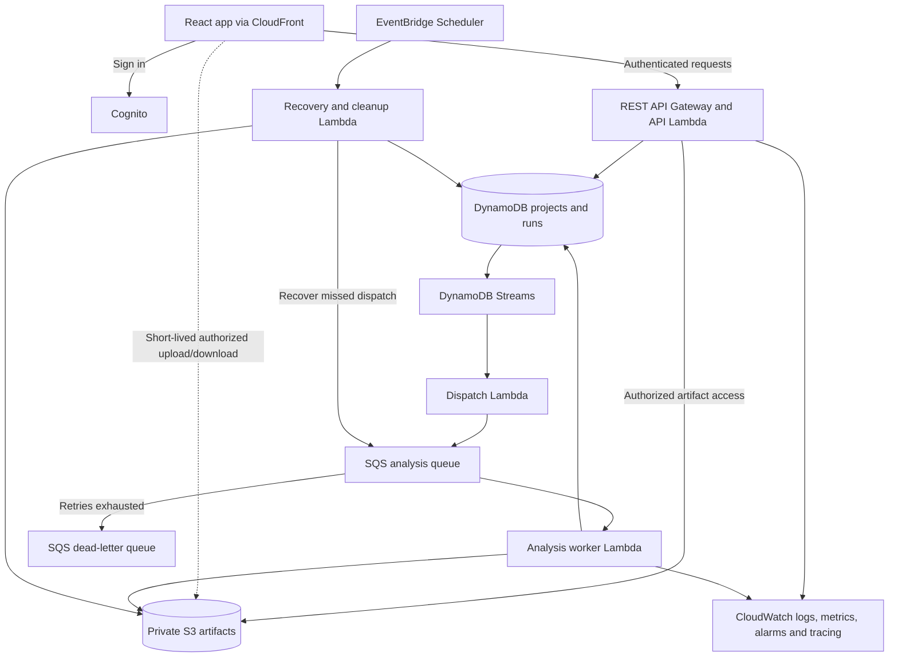

# InfraLens Portfolio And AWS Engineering Roadmap

Last redesigned: September 23, 2026. This replaces the previous analyzer-focused roadmap.
Local baseline: `main` at `694ff3d`; analyzer coverage (#52) and template validation (#51) are merged.
Everything below the baseline is planned, not implemented or deployed.

## Goal And Scope

Build an AWS-backed developer tool that demonstrates engineering judgment and provides hands-on
experience with persistence, asynchronous processing, reliable messaging and cloud operations.
The objective is a strong portfolio project and useful learning, not exhaustive AWS analysis.

The existing analyzer is sufficient for this stage. Fix serious correctness problems and regressions,
but defer more rules, SDK coverage and obscure IAM cases unless a planned workflow needs them.
The final showcase comes after the core milestones so it can demonstrate the finished workflow.
Use small fixtures and incremental verification throughout; postponing the showcase does not mean
postponing working software or tests.

Existing foundation: React UI, CLI, independent analyzer, Express/Lambda adapters, Cognito-protected
REST API, CDK, graph analysis, policy suggestions, apply/compare/export, and local integration tests.
See [HANDOFF](../HANDOFF.md) for current behavior and [analyzer limits](ANALYZER_COVERAGE.md).

## Chosen Architecture

Keep the current npm workspaces and analyzer boundaries. Start with two DynamoDB tables for
metadata and a private S3 artifact bucket, then add an SQS worker and reliable dispatch. Keep AWS
adapters outside `packages/analyzer`; use the existing API and CDK workspaces initially. A future
workspace split needs its own justification and approval under the repository rules.

DynamoDB is the learning choice because the required queries are known: a user's projects, a
project's chronological runs, and a specific run. Start with on-demand capacity. PostgreSQL remains
a valid alternative if relational collaboration or arbitrary reporting becomes central; do not
introduce it alongside DynamoDB without a separate requirement.

Store complete reports/templates/source manifests in S3, not DynamoDB items. DynamoDB holds
ownership, status, timestamps, summaries, schema/analyzer versions and artifact references. This
avoids the 400 KB item limit. S3 and DynamoDB do not share a transaction, so partial saves and
orphan cleanup are explicit design work. [AWS guidance](https://docs.aws.amazon.com/amazondynamodb/latest/developerguide/bp-use-s3-too.html)

Target after the core milestones (not today's deployment):

## Milestone 1: Saved Projects And Analysis History — Start Here

**Outcome:** sign in, create a project, save an analysis, reload the app and reopen the same report.

Deliver a complete persistence feature before adding a queue:

- Projects: create, list, rename and delete. Runs: create, list with cursor pagination, open and delete.
- Save reports through server-side analysis of submitted inputs; do not treat browser-supplied
  report JSON as an authoritative analyzer result. Keep existing stateless analyze/CLI workflows.
- Use two tables with explicit access patterns: Projects partitioned by owner with project ID sort
  keys; Runs partitioned by owner/project with a chronological timestamp/run-ID sort key. Return
  an opaque run key/cursor. Avoid table scans in user-facing APIs; add indexes only for named queries.
- Derive owner identity from trusted Cognito authorizer claims (`sub`), never a submitted user ID.
  The current Lambda request contract does not expose these claims; extend and test it. Enforce
  ownership on every project, run, artifact and comparison operation, including pagination.
- Store artifacts under server-generated owner/project/run keys in a private, encrypted bucket.
  Expose downloads only after authorization using short-lived URLs; never log signed URLs.
- Add narrow storage interfaces with in-memory test adapters and AWS SDK implementations in the
  API workspace. Local tests and the CLI must remain usable without AWS credentials. An explicit
  local-development identity must never become a hosted authentication bypass.
- Make saves retry-safe with an owner-scoped idempotency key and request hash; reject reuse with
  different input. Use conditional writes/transactions for related DynamoDB records as needed.
- Model partial persistence: stage artifacts, publish completed metadata only after required writes,
  and clean abandoned uploads. A failed S3 or metadata write must not produce a successful run.
- Add CDK resources, minimal API permissions, storage configuration, and tests in the same feature.

Initial retention decision: report artifacts remain until deletion, subject to documented per-user
quotas; raw inputs expire after seven days by default. Saving inputs must be visible to the user;
source retention is opt-in. Reports can themselves contain template/policy details and are private.
Record input expiry and explain that reanalysis/comparison requiring expired inputs needs reupload.
Lifecycle/TTL are eventual cleanup mechanisms, not immediate deletion or authorization controls.
Run deletion hides access immediately and retries physical cleanup; project deletion also prevents
new writes. Start with bounded project/run quotas so cleanup is manageable.

**Learn:** DynamoDB access-pattern design, pagination, conditional writes, S3 artifact storage,
identity versus authorization, partial failure, retention and testable infrastructure adapters.

**Done when:** a saved report survives a fresh browser session; a second user cannot list/read/delete
it or obtain its artifacts; duplicate saves yield one run; failed writes recover safely; CDK and
storage integration checks pass. Verify against a disposable AWS environment as well as local
adapters before declaring hosted persistence complete.

## Milestone 2: Make History Useful

**Outcome:** a project shows how its architecture changed across saved runs.

- Select two stored runs and reuse existing template comparison. Record analyzer/schema versions
  so old reports remain readable and comparisons do not silently mix incompatible formats.
- Show run summaries, findings, timestamps and changes. Treat finding deltas cautiously when the
  analyzer version changed; do not claim that every difference reflects a template improvement.
- Apply selected fixes to create a new child run linked to its original. Preserve the original
  artifacts. Existing fix-staleness and template-validation checks still apply.
- Reanalyze retained inputs explicitly with the current analyzer. Expired inputs require reupload;
  source-aware old/new diffing is not implied by stored history and remains outside this milestone.
- Include the missing source evidence fields in the report UI only where they help explain a saved
  result or manual-review decision. This is supporting work, not a separate analyzer expansion.

**Learn:** immutable snapshots, schema evolution, provenance and API/UI integration.

**Done when:** save -> reopen -> apply -> save child -> compare -> export works using persistent
artifacts, with ownership and missing/expired-input cases tested.

## Milestone 3: Asynchronous Analysis With SQS

**Outcome:** submit an analysis, leave or refresh the page, and return to its job status and result.

This is an intentional learning and burst-handling extension; current traffic has not established
that the synchronous analyzer is too slow. Preserve its simple offline/stateless path.

- Introduce a submission API returning `202` and a run ID, plus an authorized status endpoint.
  Poll with backoff first; refresh must resume status tracking. Avoid premature WebSocket support.
- Separate submission from execution with a standard SQS queue and a worker Lambda. Queue only IDs
  and immutable artifact references, not entire templates/source trees. Validate references against
  saved job records; use the same pure analyzer inside the worker.
- Model `PENDING_DISPATCH -> QUEUED -> RUNNING -> SUCCEEDED/FAILED`, attempt counts and timestamps.
  Status updates must be conditional: dispatch acknowledgement cannot overwrite RUNNING/SUCCEEDED.
- Initially persist dispatch intent, send to SQS, and retain failed sends as recoverable pending
  records. Add a bounded recovery query/index and scheduled reconciliation in this milestone.
  A database write followed by SendMessage is not atomic; never silently strand accepted jobs.
- Handle at-least-once delivery with conditional job claims, expiring leases, attempt/fencing tokens
  and immutable attempt output keys. A stale worker cannot publish over a newer result. Suppress
  duplicate effects; do not claim exactly-once execution.
- Distinguish retryable infrastructure failures from terminal input errors. Configure visibility
  timeout against worker execution time, bounded retries, a DLQ and partial batch failure handling.
  Do not swallow retryable failures or retry invalid input indefinitely.
- Reconcile DLQ/stale jobs so the UI eventually shows failure, rather than RUNNING forever. Provide
  an operator redrive procedure and an explicit user retry creating a linked new attempt/run.
- Use separate API/worker roles, bounded worker concurrency, per-user pending-job quotas and queue
  alarms. Respect the existing reduced-account concurrency constraint when choosing settings.
- Workers recheck project deletion/tombstones before committing results. Deletion must not allow
  an in-flight worker to recreate visible data.

Lambda/SQS can redeliver messages; idempotency and partial batch responses are required design
considerations. [AWS Lambda/SQS behavior](https://docs.aws.amazon.com/lambda/latest/dg/with-sqs.html)

**Learn:** queues, backpressure, retry policy, leases, idempotency and independent compute scaling.

**Done when:** duplicate messages create one published result; a worker crash recovers; poison jobs
reach the DLQ and become visible failures; missed sends are recovered; deleting an active project
stays deleted. Demonstrate these failures using a small controlled workload, not only a happy path.

## Milestone 4: Reliable Event-Driven Dispatch And Artifact Transfer

**Outcome:** saved job intent reliably drives processing even when the API stops after writing it.

- Replace API-side SendMessage with DynamoDB Streams and a small dispatch Lambda watching new
  pending intents. Keep intent and job creation atomic in DynamoDB (one item where sufficient;
  a transaction if separate outbox/idempotency records are needed).
- The dispatcher sends to SQS and conditionally records dispatch. A crash between send and record
  can duplicate a message; milestone 3's worker remains idempotent. Filter irrelevant stream updates
  to avoid loops, monitor stream lag/failures, and retain the recovery path for missed/expired events.
- Keep pending intent durable beyond stream retention. Reconciliation queries should use a bounded,
  time-bucketed pending-work index rather than growing full-table scans or one unbounded hot key.
- Compare this change with the simpler direct-send/reconcile design in a short architecture decision
  record. It demonstrates reliable event delivery; it is not a claim that using Streams guarantees
  exactly-once delivery. [AWS transactional outbox guidance](https://docs.aws.amazon.com/prescriptive-guidance/latest/cloud-design-patterns/transactional-outbox.html)
- Add direct S3 uploads for retained job inputs using short-lived, constrained presigned requests.
  Finalization verifies ownership, size, checksums and the manifest before dispatch. Pin an immutable
  S3 version/server-side snapshot so a reusable upload URL cannot alter an accepted job's input.
  Keep source-size limits; direct upload does not mean unlimited analyzer input.
- Use EventBridge Scheduler for bounded recovery/cleanup, with checkpointing and retryable deletion.
  Expiration must cover noncurrent S3 versions if versioning is enabled. Abandoned staging objects
  must be cleaned without deleting artifacts belonging to active jobs.

**Learn:** change-data capture, the dual-write problem, eventual consistency, secure direct uploads
and scheduled maintenance. Prefer the explicit dispatcher for learning; evaluate EventBridge Pipes
later as an alternative implementation, not an additional mandatory hop.

**Done when:** interrupt the API/dispatcher around each write/send boundary and recover every
accepted job; duplicates remain harmless; upload replacement and expired-upload cases are covered;
cleanup can resume after failure without losing active data.

## Milestone 5: Operate, Measure And Explain The System

**Outcome:** reproducible deployment with evidence about reliability, capacity and cost.

- Extend CloudWatch dashboards with queue age/depth, end-to-end job latency, failure/retry counts,
  DLQ messages, dispatcher lag and storage errors. Correlate API/run/attempt IDs across logs and
  tracing without recording raw templates, source, credentials or signed URLs.
- Add alarms, budget notifications, small load-test limits and a documented teardown procedure.
  Budgets notify; quotas/concurrency/admission limits control resource consumption. Estimate cost
  from explicit workload assumptions and current pricing; do not promise a free deployment.
- Test burst absorption and worker concurrency with a reproducible synthetic workload. Record
  measured throughput/p95 latency and identify the bottleneck before recommending more services.
- Enable metadata recovery appropriate to the demo (DynamoDB point-in-time recovery and documented
  artifact protection). Exercise restore to a separate table and document how S3 references and
  deliberately deleted/expired data affect recovery. Do not resurrect deleted user access.
- Automate CDK/backend/frontend deployment with GitHub Actions OIDC and scoped AWS roles, plus an
  explicit production approval boundary. Add deployed persistence/job smoke checks and a rollback
  procedure. Keep ordinary tests credential-free and deployment separate from normal CI.
- Build a thin browser workflow test for persistence and job recovery, plus hosted checks with two
  identities. Mocks cannot establish Cognito claim mapping, S3 permissions or real queue behavior.

**Learn:** observability, workload measurement, recovery, short-lived CI credentials and operations.

**Done when:** a fresh environment can be deployed, verified, failure-tested, restored and torn down
from documentation; the repository includes measured results and honest limitations.

## Optional Scale Lab — Choose At Most One Before The Showcase

Core learning already includes DynamoDB, S3, SQS, Streams, Lambda and Scheduler. An optional lab
must have a measured trigger or a clearly labeled simulated workload and an explicit stopping point.

| Trigger / learning question | Experiment | What proves it was useful |
| --- | --- | --- |
| Accepted workloads exceed Lambda duration/memory or need different compute economics | ECS Fargate worker consuming the existing queue; keep Lambda as baseline | Compare latency/cost, queue draining, shutdown and lease recovery; document VPC/IAM choices |
| A real workflow gains independently retryable analysis, comparison and export stages | Step Functions Standard orchestration | Demonstrate per-stage recovery and explain its responsibility versus SQS; avoid duplicate retry owners |
| Multiple independent consumers need completed-run events | EventBridge completion events with durable publication | Add a real consumer, such as a project summary, and show independent failure/replay |

Do not introduce all three by default. Defer Redis, OpenSearch, EKS, multi-region replication,
team permissions and billing until an actual access pattern, workload or learning objective needs
one. A scaling design can be documented without deploying idle infrastructure.

## Final Milestone: Complete Showcase

Do this after milestones 1-5 and any deliberately selected scale lab. Existing small examples remain
for development; this is the final integrated presentation, not a prerequisite for persistence.

- Build one realistic example covering the completed feature set: sign in, create project, submit
  template/source, observe queued analysis, inspect graph/evidence, save/reopen history, apply fixes,
  compare parent/child runs and export. Demonstrate an intentional retry/failure and its recovery.
- Keep two diagrams: InfraLens's own AWS infrastructure, and the example architecture it analyzes.
  Do not imply that analyzing a service means InfraLens itself uses that service.
- Add screenshots, a short recorded walkthrough, setup instructions and a guided README entry point.
  Keep authenticated user data private; a recording/sample report can demonstrate the project
  without giving a reviewer an account or leaving a costly environment running indefinitely.
- Explain four or five decisions with alternatives: DynamoDB/S3, ownership, queue delivery,
  reliable dispatch, and any measured scale change. Label implemented, measured and future behavior.
- Include test evidence, bounded load results, approximate operating cost and known limitations.

**Portfolio release is finished when:** the full workflow is demonstrated, the failure story is
reproducible, another developer can follow setup, and the design can be explained without claiming
unimplemented capabilities. The backlog need not be empty. Resume analyzer expansion only for a
specific purpose after this release.

## How To Execute This Roadmap

Implement one milestone through small reviewable vertical slices: contract/data model, storage and
ownership, API, UI, then failure/hosted verification. Write a brief architecture decision before
consequential choices, not a large speculative framework. Keep Mocha/Chai and existing workspace
conventions; add CDK assertions and real adapter checks where they establish behavior.

The first development task is milestone 1's smallest complete slice: create a project, persist one
server-generated report in S3 with DynamoDB metadata, list/reopen it for its owner, and prove a
second identity cannot access it. Add pagination, deletion, retention and retry handling before
calling that milestone complete. No queue or new analyzer rules are needed for this first slice.
